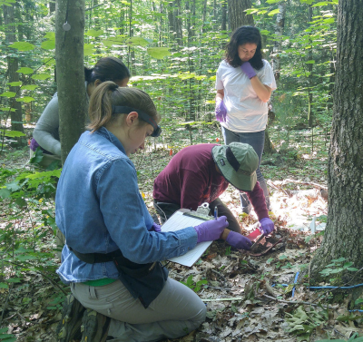
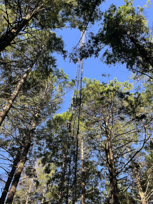
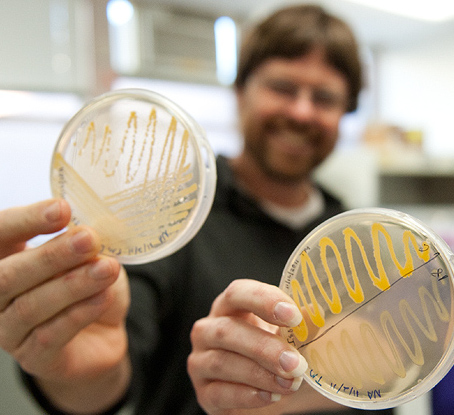

## Current Projects

### The Consequences of Long-Term Soil Warming

::: {style="float: right; position: relative; top: 10px; padding-left: 20px"}
{width="250"}
:::

The Barre Woods experimental warming site at Harvard Forest was established in 2002 by Jerry Melillo. Over the past five years, our research group has focused on understanding the effects of long-term soil warming on viral communities. Our findings suggest that prolonged warming, similar to the global trends driven by climate change, has significant impacts on diverse viral groups, including virophages, DNA phages, RNA phages, eukaryotic RNA viruses, and viroids. These changes in viral community structure may have important ecological consequences, potentially influencing microbial dynamics and feeding back into the climate system itself.

### Emerging Soil DNA and RNA Viruses

::: {style="float: left; position: relative; top: 10px; padding-right: 20px"}
{width="250"}
:::

Over the last decade, sequencing of DNA (metagenomics) and RNA (metatranscriptomics) has exponentially expanded our knowledge of virus diversity. For the past decade National Ecological Observatory Network (NEON) has been collecting and archiving soil samples in the Quabbin Reservoir Watershed, including the Harvard Forest, and at other sites across the US. The NEON data will continue to grow through yearly sampling and metagenomic sequencing over the next two decades. Our lab’s goal is to identify novel and emerging viruses in this region and identify host and climatic factors associated with changes in viral abundance. To meet our goal, we will complete the following specific objectives: 1) Determine the spatial distribution of DNA viruses from metagenomes at NEON Quabbin sites in the context of viral species from other U.S. NEON sites. 2) Identify novel and emerging DNA viruses in Quabbin sites and associated climatic factors across in a 10-year time series. 3) Determine spatial and temporal variation in RNA viruses at Quabbin sites over a 3-year window. 

### Climate, Microbes, and Medicine: Discovering Antimicrobials in Warming Forest Soils

::: {style="float: right; position: relative; top: 10px; padding-left: 20px"}
{width="250"}
:::

We’re screening soils from the Harvard Forest and Quabbin Reservoir Watershed for antimicrobial activity using an E. coli library of barcoded single-gene deletions. This approach, based on the pooled genetic screen, allows us to pinpoint which bacterial genes and traits are targeted by antimicrobial compounds found in soil. By combining this genetic screen with our rich metagenomic data, we aim to identify the biosynthetic pathways responsible for producing these natural antimicrobials—potentially leading to new antibiotics or therapeutic agents.

