::: {layout="[20,80]"}
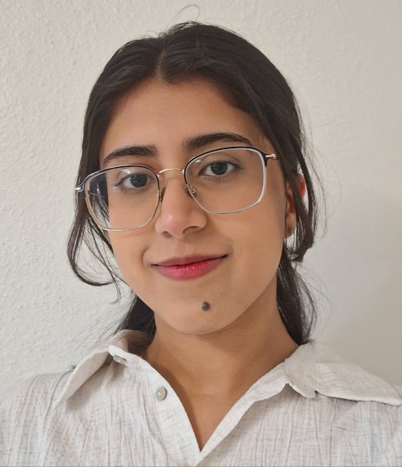{height="150"}

**Vartika Burman** - Hi! I'm Vartika and I'm a Biology and Mathematics double major. My research interests revolve around the intersection of genetics and computational biology, especially in the context of evolution, and I plan to pursue higher education in that field. Outside academics, I really enjoy watching sitcoms and painting. 
[Barre Woods Warming Experiment Virophage project](https://github.com/orgs/OurMicrobiome/teams/virophages)
:::
::: {layout="[20,80]"}
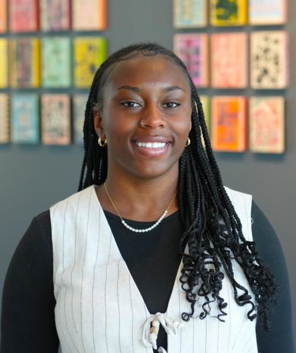{height="150"}

**Nekeria Ransom** - I am a Master’s student in the Molecular and Cellular Biology (MCB) program at UMass Amherst, where I also completed my undergraduate degree in Biology. I’m especially interested in applying my research experience and technical skills to a career in the biotechnology/ life sciences industry.
[Barre Woods Warming Experiment RNA viruses and viroids project](https://github.com/orgs/OurMicrobiome/teams/rnaviruses) and [PROPEL](https://propel.umass.edu/about-us)
:::
::: {layout="[20,80]"}
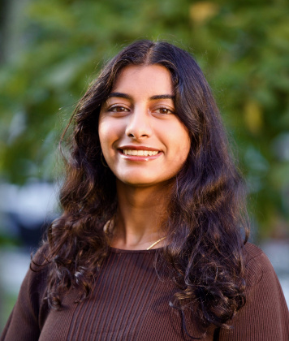{height="150"}

**Deeksha Kavalapara** - Hello! I'm Deeksha, and I am majoring in Biochemistry and Molecular Biology. I am especially interested in research areas such as genetics, molecular biology, and bioinformatics. Outside of academics, I enjoy hiking and jamming with friends. [Barre Woods Warming Experiment RNA viruses and viroids project](https://github.com/orgs/OurMicrobiome/teams/rnaviruses)
:::
::: {layout="[20,80]"}
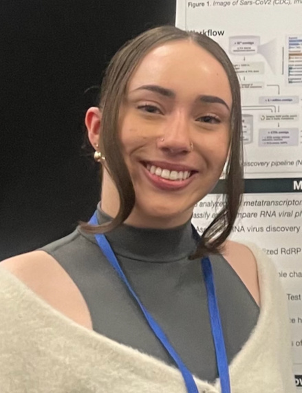{height="150"}

**Jazlynn Bailey** - Hi! I'm Jazlynn. I study how biology, technology, and health intersect. I am an honors Biology and IT student conducting research on RNA viruses and computational genomics while gaining experience in human physiology through cardiology and neurology focused shadowing, clinical research, and teaching. I enjoy working in environments that blend experimentation, data, and systems level thinking! [Barre Woods Warming Experiment RNA viruses and viroids project](https://github.com/orgs/OurMicrobiome/teams/rnaviruses)
:::
::: {layout="[20,80]"}
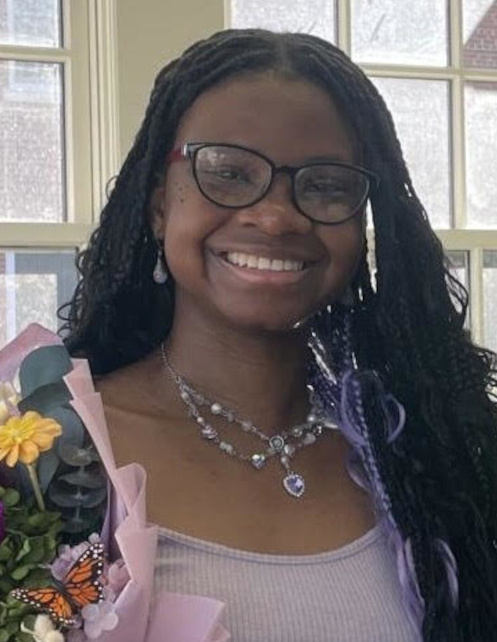{height="150"}

**Emilie Bélinette** - Hi! I’m Emilie, an honors Anthropology and Biology double major interested in the intersection of forensic science and computational microbiology. My academic interests center on applying molecular and genomic techniques to real-world forensic and anthropological problems. Outside of academics, I enjoy horror movies, hanging out with friends and visiting cute coffee shops. [NEON Harvard Forest & Quabbin Watershed Microbime project](https://github.com/orgs/OurMicrobiome/teams/neon_microbiomes)
:::
::: {layout="[20,80]"}
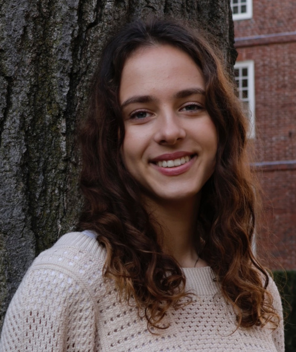{height="150"}

**Sonya Ivkovic** - Hi, I’m Sonya, a major in Computer Science! I’m interested in the crossroads of biology and computer science. Whether that be bioinformatics, modeling, or machine learning, research is integral to enriching my experience at UMass. In the future, I want to work on software that will aid biological researchers or healthcare professionals. [NEON Harvard Forest & Quabbin Watershed Microbime project](https://github.com/orgs/OurMicrobiome/teams/neon_microbiomes)
:::
::: {layout="[20,80]"}
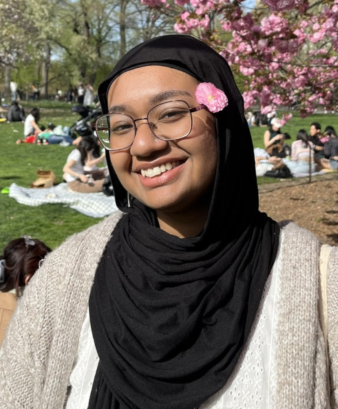{height="150"}

**Amren Hossain** - I am a Informatics major and Biology minor interested in health informatics and the study of life sciences. She aims to enhance access to research opportunities on campus, making it accessible to students from all majors.
[NEON Harvard Forest & Quabbin Watershed Microbiome project](https://github.com/orgs/OurMicrobiome/teams/neon_microbiomes) and [PROPEL](https://propel.umass.edu/about-us)
:::
::: {layout="[20,80]"}
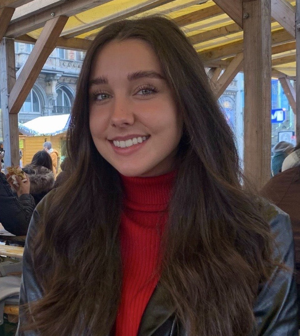{height="150"}

**Sophia Taylor** - I am a majoring in Psychology on the pre-dental track. My hope as a PROPEL Research Fellow for the future is to create opportunities for underrepresented minorities in the dental field. 
[PROPEL](https://propel.umass.edu/about-us)
:::
::: {layout="[20,80]"}
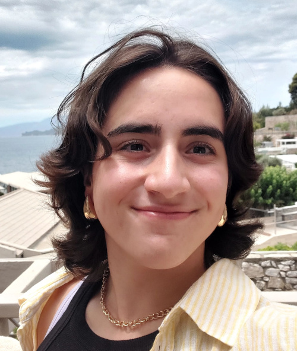{height="150"}

**Sophia Deligiannidis** - I am a Psychology and Economics double major at UMass Amherst interested researching how those with disabilities are impacted by the typical research recruitment environment, and how to avoid any discrimination within the new process that PROPEL is innovating. I want to expand PROPEL so those with disabilities can confidently apply for research labs knowing their needs will be met.  [PROPEL](https://propel.umass.edu/about-us)
:::
::: {layout="[20,80]"}
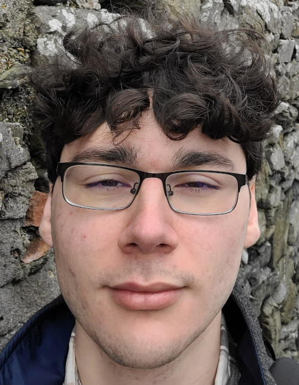{height="150"}

**Caleb Lawyer** - Hi! I'm Caleb, a Biology student. I'm currently working to screen local soil samples for anti-E. coli activity, particularly looking for novel, non-standard antibiotics. My research interests are in molecular and cellular biology, drug discovery, and finding therapies for modern diseases. In my free time, I'm passionate about music and tabletop games.
[Discovering Antimicrobials in Forest Soils](https://github.com/orgs/OurMicrobiome/teams/antimicrobials)
:::
::: {layout="[20,80]"}
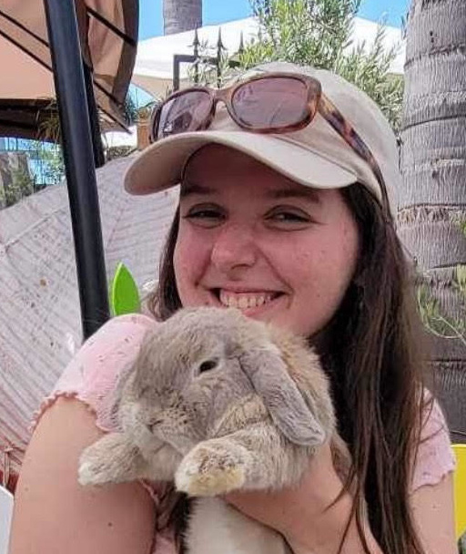{height="150"}

**Sarah Ratka** - Hi! I‘m Sarah, a Microbiology and German Studies double major at UMass Amherst. My research interests are in pathogenic microbiology, specifically drug targeting and antibiotic resistant bacteria. Outside of the lab I like to bake, rock climb, and do crossword puzzles.
[Discovering Antimicrobials in Forest Soils](https://github.com/orgs/OurMicrobiome/teams/antimicrobials)
:::
::: {layout="[20,80]"}
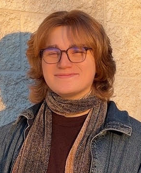{height="150"}

**Callum Daly** - I'm Cal, a Biochemistry and Molecular Biology major and who wants to know more about the world of metagenomics and what it could possibly mean for human health. In the lab, I will be helping screen soil samples for novel antibiotics, and hope to mix both hands-on and computational techniques in my research. In the future, I would love to continue studying phage and novel DNA modifications as well as the applications of microbiology in human health.
[Discovering Antimicrobials in Forest Soils](https://github.com/orgs/OurMicrobiome/teams/antimicrobials)
:::
::: {layout="[20,80]"}
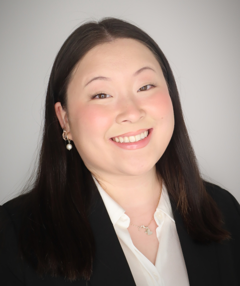{height="150"}

**Mai See Thao** - My name is Mai See, and I am a microbiology major at UMass Amherst. While I truly love all areas of microbiology, I am especially interested in hands-on drug development, whether it be in biotech, regenerative medicine, pharmaceuticals - you name it! During my free time, I enjoy diving into the world of true crime and psychological thrillers!
[Discovering Antimicrobials in Forest Soils](https://github.com/orgs/OurMicrobiome/teams/antimicrobials)
:::
::: {layout="[20,80]"}
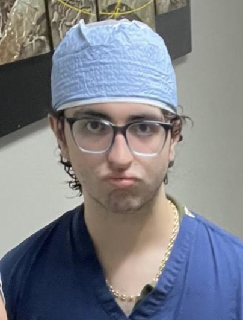{height="150"}

**Sergio Lugo-Fraga** - Hi! My name is Sergio and I am a Biology major on the pre-med track. I am mainly interested in seeing how antimicrobial research could advance the medical field. I am especially curious about how lab discoveries can translate into clinical therapies that directly impact public health. Outside of the lab, I like to play the drums and perform with my band!
[Discovering Antimicrobials in Forest Soils](https://github.com/orgs/OurMicrobiome/teams/antimicrobials)
:::

------------------------------------------------------------------------

-   [Lab Photos Through the Years](lab_photos.html)
-   [List of Current and Former Scientists in Our Lab](people_list.html)
